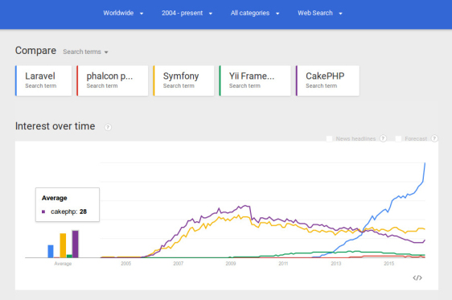

## Kennissessie Laravel
#### 2 augustus 2017
<!--v-->
### Agenda
* Introductie Frameworks en Laravel
* Technische architectuur 
* Een simpele MVC applicatie met Laravel 5.4
* Complexer voorbeeld: Koppelkans
<!--s-->
### Wat is een framework
*'De structuur waarop je een applicatie kunt bouwen'*
* Hulpmiddel om beter en sneller te ontwikkelen
  Beter: Je bouwt verder op een bewezen oplossing 
Sneller: generieke zaken zijn al opgelost  
(MVC, routering, migrations en seeders, testtools, beveiliging)  
* Focus op het domein/businessrules 

<!--v-->
### Wat is Laravel
*Een gratis (opensource) PHP web framework*
* MVC staat centraal
* Modulair
* Dedicated Dependency Manager (IOC container)
* Object-relational mapping: Eloquent 
 
<!--v-->
## Voordelen
* Goed gedocumenteerd (Laracasts)
* Grote actieve gemeenschap
* Krachtige en elegante syntax
* Eenvoudige depedency injection (IOC/Facades)
* Artisan
 
<!--v-->
#### Populariteit Frameworks - interesse

wordpress.com 2016
<!--v-->
#### Populariteit Frameworks - Gebruik

Coderseye 2017